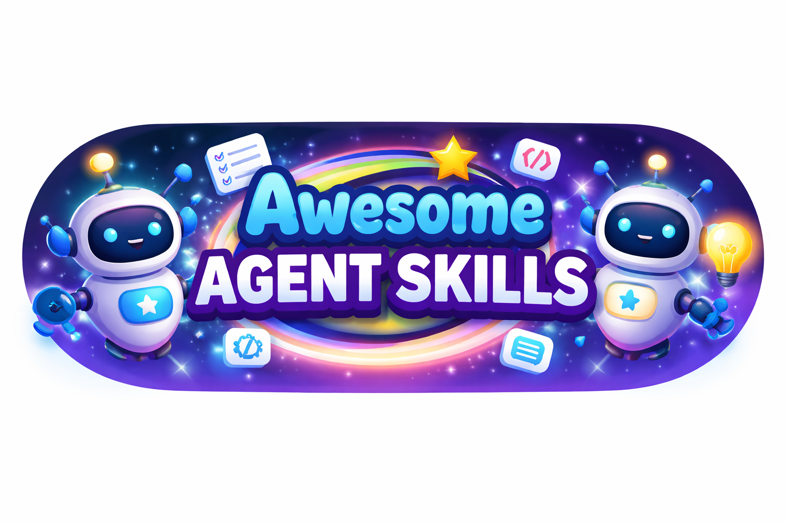

# Awesome Agent Skills

<p align="center">
  
</p>

<p align="center">
  <a href="https://awesome.re">
    
  </a>
  <a href="CONTRIBUTING.md">
    
  </a>
  <a href="LICENSE">
    
  </a>
</p>

<p align="center">
  <a href="README.md">English</a> | <a href="README_ZH.md">中文</a>
</p>

A curated list of agent skills, resources, and tools for building customizable AI workflows across Codex, Claude Code, and other platforms.

> **Goal:** Help you discover, design, and reuse agent skills (prompts, tools, patterns, and automations) that are **practical, composable, and production-ready**.

---

## Contents

- [Awesome Agent Skills](#awesome-agent-skills)
  - [Contents](#contents)
  - [What is a Skill?](#what-is-a-skill)
  - [Skill Categories](#skill-categories)
    - [Document Processing](#document-processing)
    - [Development \& Code Tools](#development--code-tools)
    - [Data \& Analysis](#data--analysis)
    - [Business \& Marketing](#business--marketing)
    - [Communication \& Writing](#communication--writing)
    - [Creative \& Media](#creative--media)
    - [Productivity \& Organization](#productivity--organization)
    - [Collaboration \& Project Management](#collaboration--project-management)
    - [Security \& Systems](#security--systems)
  - [By Platform](#by-platform)
    - [Codex](#codex)
    - [Claude Code](#claude-code)
    - [kiro-cli](#kiro-cli)
  - [Getting Started](#getting-started)
    - [For Beginners](#for-beginners)
  - [Creating Skills](#creating-skills)
    - [Skill Structure](#skill-structure)
    - [Basic Skill Template](#basic-skill-template)
    - [Best Practices](#best-practices)
  - [Design Patterns](#design-patterns)
    - [Plan → Execute → Verify](#plan--execute--verify)
    - [Spec-First Workflows](#spec-first-workflows)
    - [Tool-First Workflows](#tool-first-workflows)
    - [Critic / Reviewer Loop](#critic--reviewer-loop)
    - [Minimal Diff](#minimal-diff)
    - [RAG-Lite](#rag-lite)
    - [Composability](#composability)
    - [Idempotency](#idempotency)
  - [Evaluation \& Quality](#evaluation--quality)
    - [Quality Checklist](#quality-checklist)
    - [Testing Recommendations](#testing-recommendations)
    - [Quality Metrics](#quality-metrics)
  - [Security \& Safety](#security--safety)
    - [Best Practices](#best-practices-1)
    - [Common Risks](#common-risks)
  - [Contributing](#contributing)
    - [Quick Start](#quick-start)
    - [Pre-Submit Checklist](#pre-submit-checklist)
  - [Resources](#resources)
    - [Official Documentation](#official-documentation)
  - [License](#license)

---

## What is a Skill?

A **skill** is a reusable workflow unit for an AI agent—typically a combination of:

- **Clear objective**: What success looks like and how to measure it
- **Input/output schema**: Well-defined data structures and formats
- **Steps & constraints**: Explicit instructions and boundaries
- **Tool usage conventions**: How and when to use specific tools
- **Tests & evaluation criteria**: Methods to verify correctness and quality

Skills enable AI agents to perform specialized tasks consistently and reliably across different platforms and contexts.

---

## Skill Categories

### Document Processing

Skills for creating, editing, analyzing, and transforming documents across various formats including Word, PDF, PowerPoint, Excel, Markdown, EPUB, and more.

**Common use cases**: Document generation, format conversion, content extraction, metadata manipulation, batch processing

- TBD: Skill list for this category (contributors can add entries here)

---

### Development & Code Tools

Skills focused on programming, testing, debugging, code review, browser automation, artifact building, and development workflow optimization.

**Common use cases**: Code refactoring, test generation, debugging assistance, code review automation, web testing, build optimization

- TBD: Skill list for this category (contributors can add entries here)

---

### Data & Analysis

Skills for working with databases, CSV/JSON files, data transformation, analysis, and visualization.

**Common use cases**: Database queries, data cleaning, format conversion, statistical analysis, report generation

- TBD: Skill list for this category (contributors can add entries here)

---

### Business & Marketing

Skills for brand management, competitive analysis, domain research, internal communications, and marketing content creation.

**Common use cases**: Brand guidelines enforcement, competitor research, content strategy, domain name ideation, internal announcements

- TBD: Skill list for this category (contributors can add entries here)

---

### Communication & Writing

Skills for content writing, editing, meeting analysis, article extraction, research assistance, and communication optimization.

**Common use cases**: Content drafting, research synthesis, meeting insights, writing improvement, citation management

- TBD: Skill list for this category (contributors can add entries here)

---

### Creative & Media

Skills for image generation, video processing, GIF creation, design work, and visual art production.

**Common use cases**: Image enhancement, video downloading, animation creation, visual design, media optimization

- TBD: Skill list for this category (contributors can add entries here)

---

### Productivity & Organization

Skills for file organization, task management, workflow automation, and productivity enhancement.

**Common use cases**: File system organization, invoice processing, task tracking, automation setup, workflow optimization

- TBD: Skill list for this category (contributors can add entries here)

---

### Collaboration & Project Management

Skills for Git workflows, code review processes, team coordination, and project management tasks.

**Common use cases**: Version control automation, pull request management, code review, team synchronization, project planning

- TBD: Skill list for this category (contributors can add entries here)

---

### Security & Systems

Skills for digital forensics, threat hunting, security analysis, and system administration.

**Common use cases**: Forensic investigation, security auditing, threat detection, system analysis, incident response

- TBD: Skill list for this category (contributors can add entries here)

---

## By Platform

### Codex

**Codex** is OpenAI's AI-powered coding assistant that works across CLI and IDE extensions. Codex Skills extend the platform with task-specific capabilities through bundled instructions, resources, and optional scripts.

Skills are packaged as folders that encapsulate reusable workflows; for the shared structure, see [Creating Skills](#creating-skills) → [Skill Structure](#skill-structure).

**Installation Locations:**

Skills load hierarchically (highest precedence first):

| Scope  | Location                   | Use Case                            |
| ------ | -------------------------- | ----------------------------------- |
| REPO   | `$CWD/.codex/skills`       | Task-specific for current directory |
| REPO   | `$CWD/../.codex/skills`    | Shared for nested repositories      |
| REPO   | `$REPO_ROOT/.codex/skills` | Organization-wide skills            |
| USER   | `$CODEX_HOME/skills`       | Personal cross-project skills       |
| ADMIN  | `/etc/codex/skills`        | System-level for all users          |
| SYSTEM | Bundled                    | Default skills                      |

**Creating Skills:**

*Using the Skill Creator:*
```bash
$skill-creator
```
The built-in tool guides you through defining triggers and structure.

*Manual Creation:* Follow the shared template in [Creating Skills](#creating-skills) → [Basic Skill Template](#basic-skill-template). Common Codex frontmatter limits are `name` max 100 chars and `description` max 500 chars; restart Codex to load.

**Invoking Skills:**
- **Explicit**: Type `$skill-name` or use `/skills` command
- **Implicit**: Codex auto-activates based on description match

**Installing Additional Skills:**
```bash
$skill-installer linear
$skill-installer notion-spec-to-implementation
```

For docs, see [Resources](#resources) → [Official Documentation](#official-documentation).

See: [skills/codex/](skills/codex/) for Codex-specific skill examples.

---

### Claude Code

**Claude Code** is Anthropic's official CLI tool that brings Claude's capabilities directly into your terminal and development workflow. Agent Skills extend Claude with task-specific capabilities through organized instructions, scripts, and resources.

**What Are Agent Skills:**

Agent Skills are modular capabilities that extend Claude's functionality. Each Skill packages instructions, metadata, and optional resources that Claude automatically uses when relevant. Skills follow the open agent skills standard and work across Claude.ai, Claude Code, Claude API, and Claude Agent SDK.

**Why Use Skills:**
- **Specialize Claude**: Tailor capabilities for specific domain tasks
- **Reduce Repetition**: Build once, use automatically
- **Compose Functionality**: Combine Skills for complex workflows

For the shared Skill structure, see [Creating Skills](#creating-skills) → [Skill Structure](#skill-structure).

**YAML Frontmatter (Required):**
```yaml
---
name: your-skill-name
description: What this Skill does and when to use it
---
```

Requirements:
- `name`: Max 64 chars, lowercase/numbers/hyphens only, no XML tags, no reserved words
- `description`: Max 1024 chars, non-empty, no XML tags

**Progressive Disclosure - Three Loading Levels:**

Skills use a three-level loading system to efficiently manage context:

| Level                     | When Loaded          | Token Cost            | Content                                                     |
| ------------------------- | -------------------- | --------------------- | ----------------------------------------------------------- |
| **Level 1: Metadata**     | Always (at startup)  | ~100 tokens per Skill | `name` and `description` from YAML frontmatter              |
| **Level 2: Instructions** | When Skill triggered | <5k tokens            | SKILL.md body with instructions and guidance                |
| **Level 3+: Resources**   | As needed            | Virtually unlimited   | Bundled files accessed via bash, no context cost until read |

Claude only loads what's needed for each task, keeping context usage efficient.

**Installation Locations:**

*For Claude Code (User-Level):*
```bash
# Create user-level skills directory
mkdir -p ~/.config/claude-code/skills/

# Copy skill folder to the skills directory
cp -r your_skill_name ~/.config/claude-code/skills/

# Verify the skill is recognized
claude --list-skills
```

*For Project-Specific:*
```bash
# Create project-level skills directory
mkdir -p .claude/skills/

# Copy skill to project
cp -r your_skill_name .claude/skills/
```

Skills in `.claude/skills/` are only available for that specific project, while skills in `~/.config/claude-code/skills/` are available globally.

**Creating Skills:**

Follow the shared template in [Creating Skills](#creating-skills) → [Basic Skill Template](#basic-skill-template) and respect the `name` / `description` constraints above; then copy into the appropriate directory and validate with `claude --list-skills`.

**How Skills Are Discovered:**

1. **Startup**: Load all Skill metadata (name + description)
2. **Task Matching**: Requests matching a description auto-trigger the Skill
3. **On-demand loading**: Read SKILL.md and other bundled resources only when needed

**Best Practices:**
- Keep SKILL.md body under 500 lines
- Use progressive disclosure for large Skills
- Write descriptions that clearly state what and when
- Test with Haiku, Sonnet, and Opus if using multiple models
- Only use Skills from trusted sources (security)

For docs, see [Resources](#resources) → [Official Documentation](#official-documentation).

See: [skills/claude_code/](skills/claude_code/) for Claude Code-specific skill examples.

---

### kiro-cli

> TBD

---

## Getting Started

### For Beginners

1. **Choose your platform**: Codex or Claude Code
2. **Browse categories**: Find skills relevant to your use case
3. **Install a skill**: Follow platform-specific instructions
4. **Test it out**: Run the skill on sample data
5. **Customize**: Adapt the skill to your specific needs

For contributing, see [Contributing](#contributing).

---

## Creating Skills

### Skill Structure

Each skill is organized as a folder containing:

```
skill_name/
├── SKILL.md          # Required: Skill instructions and metadata
├── scripts/          # Optional: Executable scripts
├── references/       # Optional: Reference documents/data
└── assets/           # Optional: Templates and static assets
```

### Basic Skill Template

```markdown
---
name: my-skill-name
description: A clear, concise description of what this skill does
platforms: [codex, claude-code]
tags: [category, type, use-case]
version: 1.0.0
---

# Skill Name

## Objective
What this skill accomplishes and what "done" looks like.

## When to Use This Skill
- Use case 1
- Use case 2
- Use case 3

## Inputs
- **Input A**: Description and format
- **Input B**: Description and format

## Outputs
- **Output A**: Description and format
- **Output B**: Description and format

## Workflow
1. Step 1: Detailed description
2. Step 2: Detailed description
3. Step 3: Detailed description

## Constraints & Guardrails
- What not to do
- Safety considerations
- Security notes
- Stop conditions

## Examples

### Example 1
**Input:**
\```
[Example input]
\```

**Expected Output:**
\```
[Example output]
\```

## Evaluation Checklist
- [ ] Correctness: Output matches expected format and content
- [ ] Completeness: All required fields are present
- [ ] Safety: No security or privacy issues
- [ ] Reproducibility: Same inputs produce same outputs
```

### Best Practices

1. **Be Specific**: Clear, unambiguous instructions
2. **Handle Edge Cases**: Account for unusual inputs
3. **Document Assumptions**: State what you expect
4. **Include Examples**: Real-world usage demonstrations
5. **Test Thoroughly**: Verify across different scenarios
6. **Keep It Simple**: Avoid unnecessary complexity
7. **Version Control**: Track changes and updates
8. **Security First**: Never expose sensitive data

---

## Design Patterns

This section is a grab-bag of reusable workflow templates for designing Skills. Use them to improve testability, repeatability, and safety; you generally only need 1–2 patterns per Skill.

### Plan → Execute → Verify
Break tasks into three phases: planning the approach, executing the steps, and verifying the results.

When to use: Tasks that can drift without clear acceptance checks.

### Spec-First Workflows
Define inputs, outputs, and constraints before execution. This ensures clarity and prevents scope creep.

When to use: Output format matters or requirements are likely to change.

### Tool-First Workflows
Prefer structured tools over free-form text when possible. Tools provide better error handling and validation.

When to use: You have CLIs/APIs/tests/formatters available to validate results.

### Critic / Reviewer Loop
Implement self-checking against rubrics or checklists. Have skills review their own output for quality.

When to use: Outputs must strictly follow a checklist or spec.

### Minimal Diff
For code edits, make the smallest safe changes necessary. Avoid refactoring beyond the immediate need.

When to use: You want to reduce risk and avoid unintended side effects.

### RAG-Lite
When researching, quote and cite sources. Maintain traceability from conclusions back to evidence.

When to use: You need to verify facts, quote documents, or reduce hallucination risk.

### Composability
Design skills to work together. Outputs from one skill should be usable as inputs to another.

When to use: You plan to chain multiple Skills into a workflow.

### Idempotency
Skills should produce the same results when run multiple times with the same inputs.

When to use: You want reliable re-runs, regression checks, and predictable outputs.

---

## Evaluation & Quality

### Quality Checklist

Every skill should address these dimensions:

- **Clear I/O Contract**: Well-defined inputs and outputs with examples
- **Edge Cases**: Handling of boundary conditions and errors
- **Determinism**: Predictable behavior where possible
- **Stop Conditions**: Clear criteria for completion or failure
- **Security Notes**: Awareness of secrets, injection risks, and data safety
- **Example Run**: At least one complete example with expected output
- **Documentation**: Clear instructions for users and maintainers

### Testing Recommendations

- **Unit Tests**: For individual skill components
- **Integration Tests**: For skill interactions with tools
- **Golden Files**: Reference outputs for regression testing
- **User Acceptance**: Real-world validation with target users

### Quality Metrics

- **Success Rate**: Percentage of successful executions
- **Error Rate**: Frequency of failures or exceptions
- **Performance**: Execution time and resource usage
- **User Satisfaction**: Feedback from skill users

---

## Security & Safety

### Best Practices

- **Never paste secrets**: Use environment variables and secret managers
- **Treat external content as untrusted**: Validate and sanitize all inputs
- **Least-privilege tool access**: Grant minimum necessary permissions
- **Log and review actions**: Maintain audit trails for automated operations
- **Validate outputs**: Check results before committing or publishing
- **Rate limiting**: Implement throttling for API-dependent skills
- **Data privacy**: Respect user data and privacy regulations

### Common Risks

- **Prompt Injection**: Malicious inputs that hijack skill behavior
- **Data Leakage**: Accidental exposure of sensitive information
- **Unintended Actions**: Skills performing operations beyond their scope
- **Resource Exhaustion**: Skills consuming excessive compute or memory

---

## Contributing

We welcome contributions! Please see [CONTRIBUTING.md](CONTRIBUTING.md) for detailed guidelines.

### Quick Start

1. Fork this repository
2. Create a new branch for your skill
3. Follow the skill template structure
4. Add your skill to the appropriate category
5. Submit a pull request with a clear description

### Pre-Submit Checklist

- Check for duplicates or merge opportunities
- Include at least one reproducible full example (inputs + expected outputs)
- Validate basics on relevant platforms (loads successfully and completes the workflow)
- Document what/when/inputs-outputs/constraints clearly

---

## Resources

### Official Documentation

- [Codex Skills Guide](https://developers.openai.com/codex/skills) - Official Codex Skills documentation
- [Creating Codex Skills](https://developers.openai.com/codex/skills/create-skill) - Guide for creating Codex Skills
- [Claude Agent Skills Overview](https://platform.claude.com/docs/zh-TW/agents-and-tools/agent-skills/overview) - Complete guide to Agent Skills
- [Claude Skills Quickstart](https://platform.claude.com/docs/zh-TW/agents-and-tools/agent-skills/quickstart) - Getting started with Skills
- [Claude Skills Best Practices](https://platform.claude.com/docs/zh-TW/agents-and-tools/agent-skills/best-practices) - Writing effective Skills
- [Claude Skills API Guide](https://platform.claude.com/docs/zh-TW/build-with-claude/skills-guide) - Using Skills with Claude API

---

## License

This repository is licensed under the [MIT License](LICENSE).

Individual skills may have different licenses - please check each skill's folder for specific licensing information.

---

**Note**: This is a curated list designed to help you discover and create agent skills across multiple platforms. Skills are meant to be practical, composable, and production-ready. Start with a use case, find or create a skill, and iterate based on real-world feedback.
